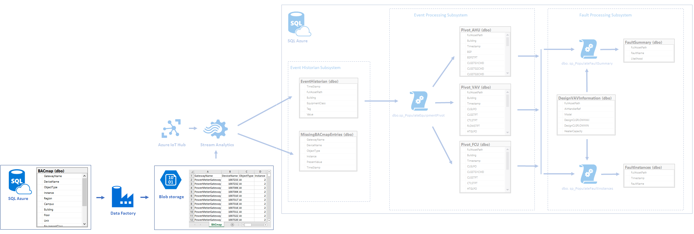

# Data Factory setup #
The instructions below will help you setup the Data Factory in the Smart Buildings project in the Azure portal. The Data Factory produces BACmap.csv files in scheduled manner, which is used by Stream Analytics job then.

## Prerequisites ##
* Azure SQL database with BACmap table
* Azure storage account

## Data Factory setup procedure ##
* Open the [Azure Management Portal](http://portal.azure.com)
* Create `SmartBuildingDF` Data Factory
	* `+` in top left corner > `Databases` > `Data Factory` >
	* `Name`: `SmartBuildingDF`.
	* `Subscription`: same as the one used for the other parts of the solution.
	* `Resource Group`: same as the one used for the other parts of the solution.
	* `Location`: your choice, considering it is always better to have the various services of a solution in the same region.
	* Click on `Create`
* Open newly created `SmartBuildingDF` Data Factory
	* Menu in top left corner > `All Resources` > type `SmartBuildingDF` in filter textbox > click on `SmartBuildingDF` record
* Click on `Author and deploy` icon
* Create LinkedServices
	* `Source-SQLAzure-t02`
		* Copy `Azure\AzureDataFactory\LinkedServices\Source-SQLAzure-t02.json` file contents into author and deploy blade text area
		* connectionString: replace `%server%`, `%database%`, `%username` and `%password%` placeholders with corresponding values
		* Click 'Deploy'
	* `Destination-BlobStorage-t02.json`
		* Copy `Azure\AzureDataFactory\LinkedServices\Destination-BlobStorage-t02.json` file contents into author and deploy blade text area
		* connectionString: replace `%accountname%` and `%accountkey%` placeholders with corresponding values
		* Click `Deploy`
* Create DataSets
	* `InputHourlyBACmap`
		* Copy `Azure\AzureDataFactory\DataSets\InputHourlyBACmap.json` file contents into author and deploy blade text area
		* Click `Deploy`
	* `OutputHourlyBACmap`
		* Copy `Azure\AzureDataFactory\DataSets\OutputHourlyBACmap.json` file contents into author and deploy blade text area
		* Click `Deploy`

* Create pipeline
	* Copy `Azure\AzureDataFactory\Pipelines\CopyPipeline-t02.json` file contents into author and deploy blade text area
	* Click `Deploy`

