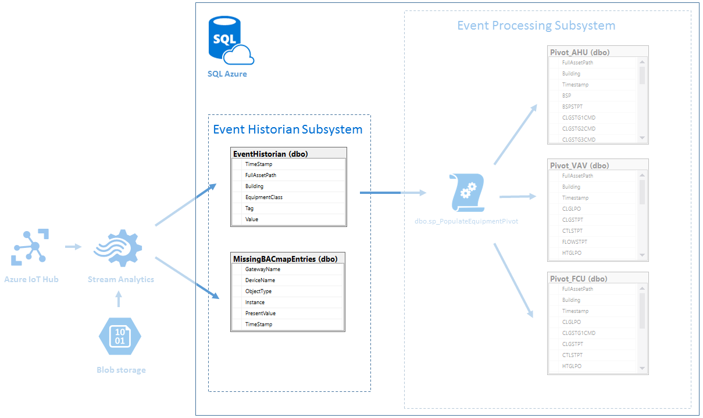

# EventHistorian subsystem #

## Brief description
EventHistorian subsystem based on Azure SQL and devoted to store raw data which comes from Azure Stream Analytics job. 
There are two types of records: 
 * associated with registered sensor
	 * data goes to EventHistorian table
 * records which don't have such association.
	 * data goes to MissingBACmapEntries table

## EventHistorian SQL Queries ##
The SQL files in this folder are as follows 

1. dbo.EquipmentTagNames.Table.sql
	* EquipmentTagNames table creation script
2. dbo.EventHistorian.Table.sql
	* EventHistorian table creation script
3. dbo.MissingBACmapEntries.Table.sql
	* MissingBACmapEntries table creation script

## Prerequisites ##
Workflow as described in the project readme.md.

