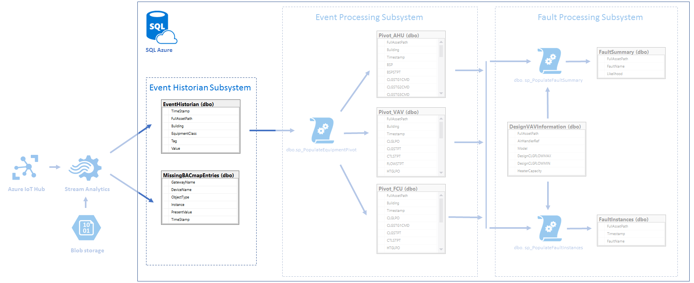

# Event Historian subsystem #

## Brief description
EventHistorian subsystem based on Azure SQL and devoted to store raw data which comes from Azure Stream Analytics job. 
There are two types of records: 
 * associated with registered sensor
	 * data goes to EventHistorian table
 * records which don't have such association.
	 * data goes to MissingBACmapEntries table

## Event Historian SQL Queries ##
The SQL files in this folder are as follows 

1. dbo.EquipmentTagNames.Table.sql
	* EquipmentTagNames table creation script
2. dbo.EventHistorian.Table.sql
	* EventHistorian table creation script
3. dbo.MissingBACmapEntries.Table.sql
	* MissingBACmapEntries table creation script

## Prerequisites ##
Workflow as described in the project readme.md.

* [SQL Database](../readme.md#Create-Azure-SQL-Database)

## Create Event Historian tables ##
* Open the Azure Management Portal, and open "WO_Procs" SQL Database: Menu in top left corner > SQL Databases > WO_Procs >
* Click `tools` icon and select `Query editor (preview)` tool
* Click login
	* `Authorization type`: `SQL server authentication`
	* `Login`: `WO_Admin`
	* `Password`: password chosen during database creation
	* Click `OK`
	* `"Authenticated as WO_Admin"` notification message should appear
	* Execute `dbo.EventHistorian.Table.sql`:
		* Click open query and select `dbo.EventHistorian.Table.sql` file or paste `dbo.EventHistorian.Table.sql` contents into text area
		* Click `Run`
	* Execute `dbo.MissingBACmapEntries.Table.sql`
	* Execute `dbo.EquipmentTagNames.Table.sql`

