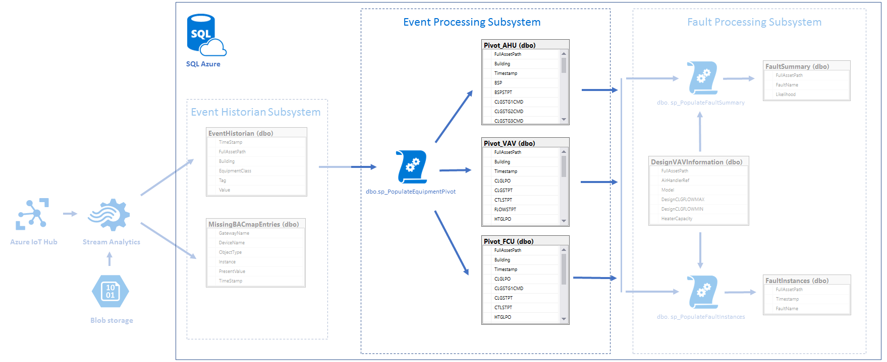

#Event Processing subsystem#

## Brief description
Event Processing subsystem based on Azure SQL and devoted to process raw data which comes from [Event Historian](../EventHistorian/readme.md). 

## Event Processing SQL Queries ##
The SQL files in this folder are as follows 

1. dbo.Pivot_AHU.Table.sql
	* Pivot_AHU table creation script
2. dbo.Pivot_FCU.Table.sql
	* Pivot_FCU table creation script
3. dbo.Pivot_VAV.Table.sql
	* Pivot_VAV table creation script
4. dbo.EquipmentTagNames.Table.sql
	* EquipmentTagNames table creation script
5. dbo.MissingTagNames.Table.sql
	* MissingTagNames table creation script
6. dbo.sp_PopulateEquipmentPivot.sql
	* sp_PopulateEquipmentPivot stored procedure creation script
7. dbo.sp_PopulateEquipmentPivotDynamically.sql
	* sp_PopulateEquipmentPivotDynamically stored procedure creation script
8. dbo.sp_PopulateEquipmentPivots.sql
	* sp_PopulateEquipmentPivots stored procedure creation script
9. dbo.sp_PopulateEquipmentPivotsDynamically.sql
	* sp_PopulateEquipmentPivotsDynamically stored procedure creation script
10. dbo.sp_UpdatePivotTableSchema.sql
	* sp_UpdatePivotTableSchema stored procedure creation script
11. dbo.sp_UpdatePivotTableSchemas.sql
	* sp_UpdatePivotTableSchemas stored procedure creation script

## Prerequisites ##
Workflow as described in the project readme.md.

* [SQL Database](../readme.md#create-azure-sql-database)
* [Event Historian subsystem](../EventHistorian/readme.md#create-event-historian-tables)

## Create Event Processing tables and stored procedures ##
* Open the Azure Management Portal, and open "WO_Procs" SQL Database: Menu in top left corner > SQL Databases > WO_Procs >
* Click `tools` icon and select `Query editor (preview)` tool
* Click login
	* `Authorization type`: `SQL server authentication`
	* `Login`: `WO_Admin`
	* `Password`: password chosen during database creation
	* Click `OK`
	* `"Authenticated as WO_Admin"` notification message should appear
	* Execute `dbo.Pivot_AHU.Table.sql`:
		* Click open query and select `dbo.Pivot_AHU.Table.sql` file or paste `dbo.Pivot_AHU.Table.sql` contents into text area
		* Click `Run`
	* Execute `dbo.Pivot_FCU.Table.sql`
	* Execute `dbo.Pivot_VAV.Table.sql`
	* Execute `dbo.EquipmentTagNames.Table.sql`
	* Execute `dbo.MissingTagNames.Table.sql`
	* Execute `dbo.sp_PopulateEquipmentPivot.sql`
	* Execute `dbo.sp_PopulateEquipmentPivotDynamically.sql`
	* Execute `dbo.sp_PopulateEquipmentPivots.sql`
	* Execute `dbo.sp_PopulateEquipmentPivotsDynamically.sql`
	* Execute `dbo.sp_UpdatePivotTableSchema.sql`
	* Execute `dbo.sp_UpdatePivotTableSchemas.sql`
