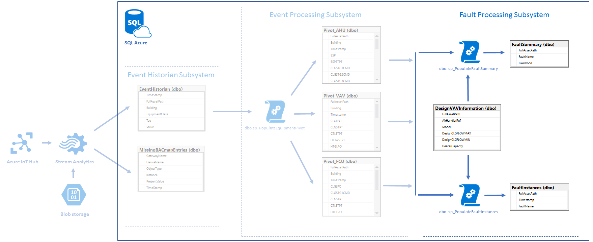

# Fault Processing subsystem #

## Brief description
Fault Processing subsystem based on Azure SQL and devoted to process data which comes from [Event Processing](../EventProcessing/readme.md) pivot tables and diagnose faults. 

## Fault Processing SQL Queries ##
The SQL files in this folder are as follows 

1. dbo.FaultInstances.Table.sql
	* FaultInstances table creation script
2. dbo.FaultSummary.Table.sql
	* FaultSummary table creation script
3. dbo.DesignVAVInformation.Table.sql
	* DesignVAVInformation table creation script
4. dbo.sp_PopulateFaultInstances.sql
	* sp_PopulateFaultInstances stored procedure creation script
5. dbo.sp_PopulateFaultSummary.sql
	* sp_PopulateFaultSummary stored procedure creation script

## Prerequisites ##
Workflow as described in the project readme.md.
* [SQL Database](../readme.md#create-azure-sql-database)
* [Event Historian subsystem](../EventHistorian/readme.md#create-event-historian-tables)
* [Event Processing subsystem](../EventProcessing/readme.md#create-event-processing-tables-and-stored-procedures)

## Create Event Processing tables and stored procedures ##
* Open the Azure Management Portal, and open "WO_Procs" SQL Database: Menu in top left corner > SQL Databases > WO_Procs >
* Click `tools` icon and select `Query editor (preview)` tool
* Click login
	* `Authorization type`: `SQL server authentication`
	* `Login`: `WO_Admin`
	* `Password`: password chosen during database creation
	* Click `OK`
	* `"Authenticated as WO_Admin"` notification message should appear
	* Execute `dbo.FaultInstances.Table.sql`:
		* Click open query and select `dbo.FaultInstances.Table.sql` file or paste `dbo.FaultInstances.Table.sql` contents into text area
		* Click `Run`
	* Execute `dbo.FaultSummary.Table.sql`
	* Execute `dbo.DesignVAVInformation.Table.sql`
	* Execute `dbo.sp_PopulateFaultInstances.sql`
	* Execute `dbo.sp_PopulateFaultSummary.sql`

