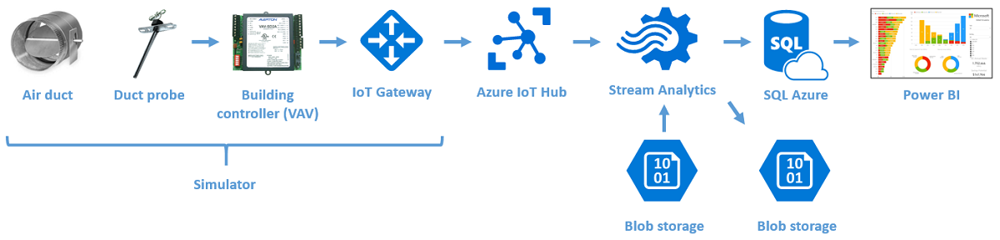
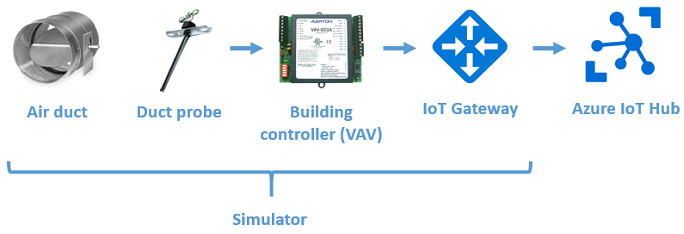
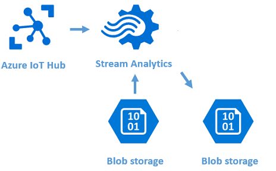
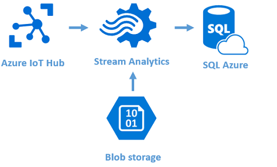
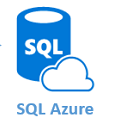
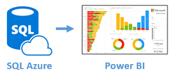

# Getting Started with the Smart Buildings PCS 

The following steps are intended to help you understand the basic constructs of a Building Management 
System using only Microsoft technologies. You will build an end-to-end solution that pushes data 
from one or more simulated building sensors to Azure and then runs some basic data processing and 
analytics on that data, in the hope that this will give you a clearer understanding of what commercial 
BMSs like ICONICS do. The working solution is NOT meant to be a replacement for an enterprise BMS, but only 
a Proof of Concept.

## Prerequisites
Before running through the following steps, you need to have

* [Microsoft SQL Server Management Studio](https://msdn.microsoft.com/library/mt238290.aspx) installed
* [Device Explorer](https://github.com/Azure/azure-iot-sdks/releases) installed
* Joined the [Azure-Samples](https://repos.opensource.microsoft.com/Azure-Samples) organization in GitHub

## Overall architecture ##

Here is a picture of this step in the end-to-end solution:

&nbsp;&nbsp;&nbsp;&nbsp;&nbsp;&nbsp;&nbsp;

In this set of steps, you will build this end-to-end solution in stages.

## Step 1: Load a device simulator
Here is a picture of this step in the end-to-end solution:

&nbsp;&nbsp;&nbsp;&nbsp;&nbsp;&nbsp;&nbsp;

Please follow these steps:

1. Log into your laptop using your Microsoft credentials, and access the private Smart Building repository on the [Azure-Samples website](https://github.com/Azure-Samples/services-iot-hub-dotnet-smartbuilding). Either download `SmartBuildingSimulatorBinaries.zip` from the `/Simulator/binaries` folder and unzip it, or, optionally, use Git to clone the entire project to your laptop and build `SimulatedSensors.Windows.sln` using Visual Studio.
2. Read through the [readme.md](https://github.com/Azure-Samples/services-iot-hub-dotnet-smartbuilding/blob/master/Simulator/readme.md) file in the Simulator folder to get an understanding of what the Simulator does.
3. Launch `SimulatedSensors.Windows.exe` and follow the steps in the [readme.md](https://github.com/Azure-Samples/services-iot-hub-dotnet-smartbuilding/blob/master/Simulator/readme.md) file to 
    - Get the connection string for `TR24SmartBuildingHub`
    - Get the connection string for `TR24SmartBuildingDB`
    - Configure the SQL firewall rules to allow access to your laptop IP address
    - Find a DeviceId registered in the IoT Hub
    - Select names for the simulator text fields from the drop-down menus
    - Send data and verify it is being received by the IoT Hub

    When prompted to enter data in the Simulator, use the following: 

    - **Connection String (of IoT Hub)**: `{TR24SmartBuildingHub Connection String}` 
    - **DB Connection String (optional)**: `{TR24SmartBuildingDB Connection String}` 
    - **DeviceId (IoT Hub registered device)**: Select `tr24IoTHubDeviceId` from the drop-down list of available Ids 
    - **GatewayName**: Select `{Alias}Gateway` from the drop-down list of available GatewayNames 
    - **DeviceName**: Select from drop-down list 
    - **ObjectType**: Select from drop-down list  
    - **Instance**: Select from drop-down list  

    You have successfully completed this step if and only if the data that you see being transmitted from the Simulator is included in the data you see being received in Device Explorer. Bear in mind that the data from all
    the other workshop participants is also being received by the same IoT Hub, so you will need to watch carefully for your data.

*Estimated time to complete: 15 minutes*

## Step 2: Create an Azure Stream Analytics job
In this step, you will push data from the device into blob storage. Here is a picture of this step in the end-to-end solution:

&nbsp;&nbsp;&nbsp;&nbsp;&nbsp;&nbsp;&nbsp;

Please follow these steps:

1. Download and open `BACmap.csv` to view the reference data that you need to join with the streaming device data in IoT Hub.
2. Follow the steps in the [readme.md](https://github.com/Azure-Samples/services-iot-hub-dotnet-smartbuilding/blob/master/Azure/StreamAnalytics/readme.md) file in the Azure/StreamAnalytics folder of the Azure-Samples website to
create an Azure Stream Analytics job called `{Alias}LogAllEvents` that outputs the data received from IoT hub for your Simulator to blob storage
    - Join the data from the Simulator with the reference data in `BACmap.csv`. Don't forget to add a filter in the query to capture only your Simulator's data. 
    - Output the data to a blob called `{Alias}ASAOutput` in the container `tr24smartbuilding`
3. Download the output blob to verify that you have correctly captured only the data from your Simulator.

You have successfully completed this Step if and only if the data that you saw in Device Explorer is represented in the output blob, but 
instead of having the BACnet addressing scheme for your simulated device, it has the physical address of the device.

*Estimated time to complete: 20 minutes*

## Step 3: Push the device data into an Event Historian table in SQL
In this Step, you will modify the Stream Analytics job to push data from your device to a table in SQL Azure. Here is a picture of this step in the end-to-end solution:

&nbsp;&nbsp;&nbsp;&nbsp;&nbsp;&nbsp;&nbsp;

Please follow these steps:

1. Read through the [readme.md](https://github.com/Azure-Samples/services-iot-hub-dotnet-smartbuilding/blob/master/Azure/SQLServer/EventHistorian/readme.md) file 
in the Azure/SQLServer/EventHistorian folder to get an understanding of what the EventHistorian is used for.
2. Edit and execute the `dbo.EventHistorian.Table.sql` script 
in the [Azure/SQLServer/EventHistorian](https://github.com/Azure-Samples/services-iot-hub-dotnet-smartbuilding/blob/master/Azure/SQLServer/EventHistorian/) 
folder to create the SQL table `dbo.{Alias}EventHistorian` in the `tr24SmartBuilding` database.
3. Modify the `{Alias}LogAllEvents` Stream Analytics job to output data to `dbo.{Alias}EventHistorian` instead of the `{Alias}ASAOutput` blob
4. Send more data from the simulator to IoT Hub. Try changing the device and object names to send different values to the Events table.
5. List the records in `dbo.{Alias}EventHistorian`.

You have successfully completed this exercise if and only if the data that you saw in `{Alias}ASAOutput` blob are represented in the `dbo.{Alias}EventHistorian` listing.

*Estimated time to complete: 10 minutes*

## Step 4: Send the event history to a pivot table

In this Step, you will create and execute a SQL Stored Procedure to take the raw event data and pivot into a format for easier consumption by Power BI. Physical devices will typically have many different sensors emitting data (for example air flow, input and output temperatures), and the pivot would be 
more populated than you will see when sending a single sensor reading from your simulator, but we need to create the pivot files for use in subsequent Steps. In this step in creation of the end-to-end solution we will be working only in SQL Azure:

&nbsp;&nbsp;&nbsp;&nbsp;&nbsp;&nbsp;&nbsp;

Please follow these steps:

1. Read through the [readme.md](https://github.com/Azure-Samples/services-iot-hub-dotnet-smartbuilding/blob/master/Azure/SQLServer/EventProcessing/readme.md) file 
in the Azure/SQLServer/EventProcessing folder to get an understanding of what the stored procedure is doing.
2. Edit and execute the `dbo.Pivot_VAV.Table.sql` script 
in the [Azure/SQLServer/EventProcessing](https://github.com/Azure-Samples/services-iot-hub-dotnet-smartbuilding/blob/master/Azure/SQLServer/EventProcessing/) 
folder to create the SQL table `dbo.{Alias}Pivot_VAV` in the `tr24SmartBuilding` database.
	* Do the same with `dbo.{Alias}Pivot_AHU.Table.sql`
	* Do the same with `dbo.{Alias}Pivot_FCU.Table.sql`
3. Edit and execute the `dbo.MissingTagNames.Table.sql` script to create table `dbo.{Alias}MissingTagNames`
4. Edit and execute the `dbo.sp_PopulateEquipmentPivot.sql` script to create stored procedure `sp_{Alias}PopulateEquipmentPivot` to push records from `dbo.{Alias}EventHistorian` to `dbo.{Alias}Pivot_VAV`, `dbo.{Alias}Pivot_AHU`, `dbo.{Alias}Pivot_FCU` and `dbo.{Alias}MissingTagNames` tables, this will create stored procedure named `sp_{Alias}PopulateEquipmentPivot`.
5. Edit and execute the `dbo.sp_PopulateEquipmentPivots.sql` script to create `sp_{Alias}PopulateEquipmentPivots` stored procedure which calls `dbo.sp_{Alias}PopulateEquipmentPivot` three times with different parameters.
6. Execute `sp_PopulateEquipmentPivots` stored procedure to push records from `dbo.{Alias}EventHistorian` to `dbo.{Alias}Pivot_VAV`, `dbo.{Alias}Pivot_AHU`,`dbo.{Alias}Pivot_FCU` and `dbo.{Alias}MissingTagNames`.
7. List the records in `dbo.{Alias}Pivot_VAV`.
8. Send more records from your simulator, rerun the stored procedure, and verify the records are displayed in the pivot file. 

You have successfully completed this Step if and only if the data that you saw in `dbo.{Alias}EventHistorian` are represented in `dbo.{Alias}Pivot_VAV`.

*Estimated time to complete: 10 minutes*

## Step 5: Create Fault processing processes

In this Step, you will create and execute a SQL Stored Procedure to take the pivoted event data and look for data indicative of problems in the equipment, known as 
'Faults'. In this step in creation of the end-to-end solution we will again be working only in SQL Azure:

&nbsp;&nbsp;&nbsp;&nbsp;&nbsp;&nbsp;&nbsp;

Please follow these steps:

1. Read through the [readme.md](https://github.com/Azure-Samples/services-iot-hub-dotnet-smartbuilding/blob/master/Azure/SQLServer/FaultProcessing/readme.md) file 
in the Azure/SQLServer/FaultProcessing folder to get an understanding of what the stored procedure is doing.
2. Edit and execute the `dbo.FaultInstances.Table.sql` script 
in the [Azure/SQLServer/FaultProcessing](https://github.com/Azure-Samples/services-iot-hub-dotnet-smartbuilding/blob/master/Azure/SQLServer/FaultProcessing/) 
folder to create the SQL table `dbo.{Alias}FaultInstances` in the `tr24SmartBuilding` database.
3. Edit and execute the `dbo.sp_PopulateFaultInstances.sql` script to create `sp_{Alias}PopulateFaultInstances` stored procedure.
4. Execute `sp_{Alias}PopulateFaultInstances` stored procedure to push records from `dbo.{Alias}Pivot_VAV` to `dbo.{Alias}FaultInstances`.
5. List the records in `dbo.{Alias}FaultInstances`.
6. Send more records from your simulator, but this time increase the temperature to above the threshold shown in the stored procedure, rerun the two stored procedures (`sp_{Alias}PopulateEquipmentPivots` and `sp_{Alias}PopulateFaultInstances`), and verify the records are displayed in the fault table. 

You have successfully completed this step if and only if you are able to generate some faults that you can see in the fault table!

*Estimated time to complete: 10 minutes*

## Step 6: Create a Power BI dashboard

In this step in creation of the end-to-end solution we will again be working only in SQL Azure:

&nbsp;&nbsp;&nbsp;&nbsp;&nbsp;&nbsp;&nbsp;

Please follow these steps:

- Create a [Power BI](http://app.powerbi.com) Dashboard that visualizes your TI Sensor Tag data in creative ways.  Feel free to use any of the Power BI Custom Visuals available [here](http://visuals.powerbi.com). You can learn how to create Power BI Dashboards from a Stream Analytics Output [here](https://azure.microsoft.com/en-us/documentation/articles/stream-analytics-power-bi-dashboard/).

*Estimated time to complete: 10 minutes*

