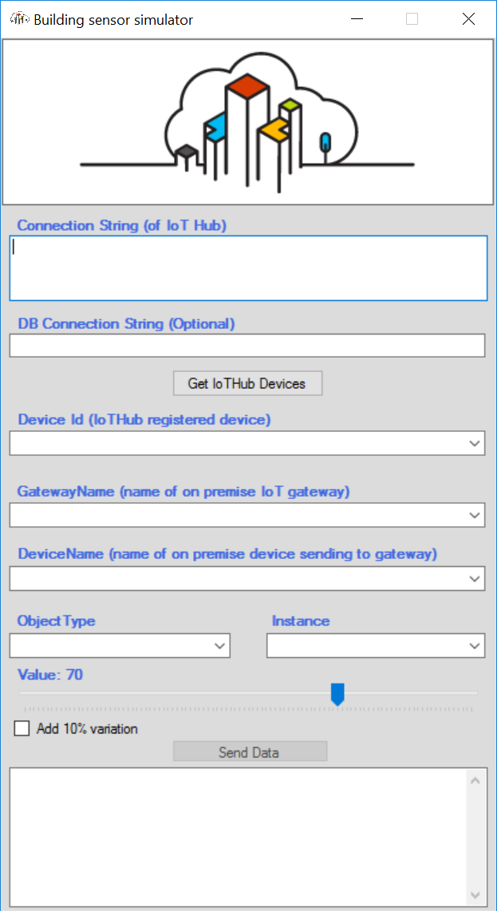
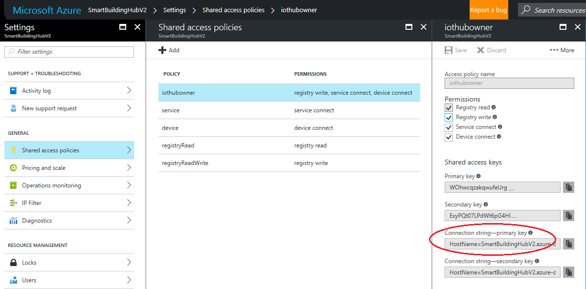

# Smart Building Simulator #
The purpose of the Smart Building Simulator is to send data to Azure IoT Hub in the format that would be sent by a 
typical building sensor. More precisely, it sends data in the format that is sent by an on-premise gateway that polls
typical compliant BACnet devices such as Variable Air Volume (VAV) systems, Air Handling Units (AHUs), etc. The simulator 
can be used to push traffic into an existing Building Management System (BMS) or Building Automation System (BAS), or into 
a home-grown infrastructure based upon IoT Hub and various other Azure services such as Azure Stream Analytics, SQL Azure, and 
Azure Machine Learning.

## Data structure ##
The simulator sends data in a prescribed JSON format. Here is a sample record:
```JSON format
{
	"GatewayName":"Spyros",
	"Timestamp":"2017-01-16T14:39:42.0048083Z",
	"Asset": {
		"DeviceName":"209101",
		"ObjectType":"AI",
		"Instance":"1",
		"PresentValue":10.0},
	"EventProcessedUtcTime":"2017-01-16T14:39:43.0427457Z",
	"PartitionId":2,
	"EventEnqueuedUtcTime":"2017-01-16T14:39:43.9530000Z",
	"IoTHub": {
		"MessageId":null,
		"CorrelationId":null,
		"ConnectionDeviceId":"SpyrosDevice1",
		"ConnectionDeviceGenerationId":"636185594611186461",
		"EnqueuedTime":"0001-01-01T00:00:00.0000000",
		"StreamId":null
    }
}
```
For the purposes of analyzing the data stream, the elements that are primarily of interest are the following:
```key JSON elements
{
	"GatewayName":"Spyros",
	"Timestamp":"2017-01-16T14:39:42.0048083Z",
	"Asset": {
		"DeviceName":"209101",
		"ObjectType":"AI",
		"Instance":"1",
		"PresentValue":10.0
	}
}
```
This would be interpreted as follows:
- GatewayName: the device sending data, for example, an on-premise IoT BACnet Gateway
- Timestamp: the time that the device is polled by the gateway. The simulator sends the timestamp in ISO 8601 format because that 
is the format that is supported by Azure Stream Analytics in a TIMESTAMP BY clause.
- Asset.DeviceName: the device the Gateway is polling, for example a building controller or a VAV
- Asset.ObjectType: the top level category of what the Gateway is polling on the physical device, such as the Analog 
Input or Analog Output ports
- Asset.Instance: the next level category of what the Gateway is polling, such as 1, 2, or 3, to represent Analog Input 1, Analog Input 2, etc
- Asset.PresentValue: the value sent by the device at the time that it is polled

## Running the Smart Building Simulator ##
To run the simulator, execute `SimulatedSensors.Windows.exe.` (It can be found in /bin/release or /bin/debug of the project file if you have built it yourself.) 

&nbsp;&nbsp;&nbsp;&nbsp;&nbsp;&nbsp;&nbsp;


You can launch multiple instances of the simulator, for example if you wish to simulate multiple devices sending to the same 
IoT Hub simultaneously. They can all use the same or different values for the various fields.

## Using the Smart Building Simulator ##
There are several mandatory fields you need to fill:
1. Connection String (of IoT Hub)
2. Device Id (IotHub registered device)
3. GatewayName (name of on premise IoT gateway)
4. DeviceName (name of on premise device sending to gateway)
5. ObjectType
6. Instance

These are described briefly below.

### Connection String ###
This simulator mimics real devices output and sends data to the IoTHub. To start working with it, 
you need to register a device in the IoT Hub that you will target, and get the Connection String for the IoT Hub itself. You will find all the instructions to create device IDs and retrieve connection strings [here](https://github.com/Azure/azure-iot-sdks/blob/master/doc/manage_iot_hub.md).

You can find connection information for managing the IoT Hub instance in the [Azure portal](http://portal.azure.com). 

&nbsp;&nbsp;&nbsp;&nbsp;&nbsp;&nbsp;&nbsp;


Once you have entered the IoT Hub Connection String, click "Get IoTHub Devices" to query the IoTHub for registered devices. (Note 
that the device Id retrieved is specifically the Id of the objects registered in IoTHub, and have no necessary relation to 
the DeviceName of the devices polled by the Gateway.) The simulator will then display a list of registered devices in the Device Id drop-down list. Pick any
of these - it does not particularly matter, as it simply allows the simulator to talk to the IoTHub and does not 
affect the data packet being transmitted by the simulator.


### Device Id ###

If you are deploying an Azure Smart Building infrastructure as outlined in [], in addition to the IoTHub connection string, you optionally can enter the Connection String to the SQL Azure 
database where telemetry data will be saved. 
When Get IoTHub Devices button is pressed the simulator will connect to the IoTHub and download list of devices associated with it, as before. 
However, the simulator will also retrieve a list of known GatewayNames, DeviceNames, ObjectTypes, and Instances, and populate the corresponding 
drop down lists. This is strictly optional, as the you can enter whatever text you want in those text boxes, and the simulator 
will send that text. The value of retrieving known devices from the SQL Azure database is only that the subsequent event processing 
code in the Azure Smart Building infrastructure will be able to recognize the sender of the data and perform lookups and analyses on 
those devices.

When "Send Data" button is pressed simulator starts to send 2 messages per second to the IoTHub. Sample of the sent message:
*`[{"GatewayName":"RedWestIoTGateway","Timestamp":"2017-01-08T21:51:34.9279678Z","Asset":{"DeviceName":"7810","ObjectType_Instance":"A_01","PresentValue":46.4}}]`*


Trackbar position defines value from 1 to 100, to add some 10% variation appropriate checkbox needs to be checked.
Trackbar value can be modified even when connection is already established and data are sending to the Hub.
 


## ConnectTheDots getting started project using Raspberry Pi and Arduino ##
For this project, follow the instructions for configuring the following:

1. [Arduino UNO with weather shield](GatewayConnectedDevices/Arduino%20UNO/Weather/WeatherShieldJson/Arduino-and-Weather-Shield-setup.md) 
2. [Raspberry Pi](Gateways/GatewayService/RaspberryPi-Gateway-setup.md) 

## Connect The Dots with all the other devices ##

To build your own end-to-end configuration you need to identify and configure the device(s) that will be producing the data to be pushed to Azure and displayed/analyzed. Devices fall generally into two categories - those that can connect directly to the Internet, and those that need to connect to the Internet through some intermediate device or gateway. Sample code and documentation can be found in the following folders:

1. [Simple devices requiring a gateway](GatewayConnectedDevices/) - Devices too small or basic to support a secure IP connection, or which need to be aggregated before sending to Azure
2. [Devices connecting directly to Azure](DirectlyConnectedDevices/) - Devices powerful enough to support a secure IP connection
3. [Gateways or other intermediary devices](Gateways/) - Devices which collect data from other devices and upload to Azure. These can be very simple (e.g. just package and send the data securely to Azure without changes), or very sophisticated (e.g. allow for device authentication, provisioning, management, and communications). 


### Build a sensor infrastructure ###
For additional scenarios, or more advanced configurations, follow the setup instructions in the folders for the devices or gateways listed above.