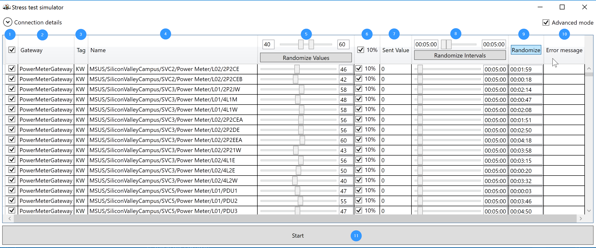

# Stress test simulator

## Brief description
1. `Enabled/Disabled`
	- Disabled devices are not sending readings to IoT hub
2. `Gateway` - Gateway name
	- Corresponding azure IoT hub device should be registered with the same name as gateway name
3. `Tag` - Device Tag
4. `Name` - Full asset path
5. `Device value`
	- Values for all devices may be randomized, just specify randomizer range with slider and press `Randomize Values` button
6. `10%` - Adds +/-10% variation to device value when enabled
7. `Sent value` - the last value sent to IoT hub
8. `Interval` - sending interval, device will send data with specified time interval
	- Nay be randomized for all devices, by specifying lower and higher bounds and pressing `Randomize Intervals` button
9. `Next send in` - The device will send reading to IoT hub when counter reaches zero
	- Can be randomized within device `Interval` bu pressing `Randomize` button

10. `Error message` - will populate with error description text if device fails to send data for some reason
11. `Start` button - no surprises here, starts the process

